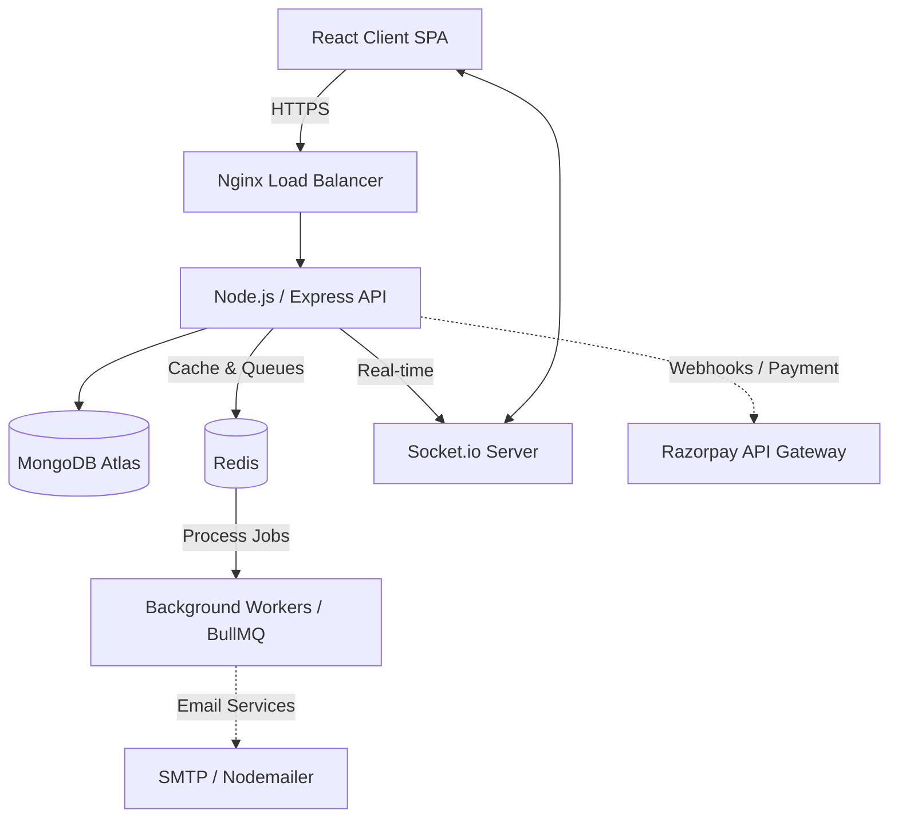
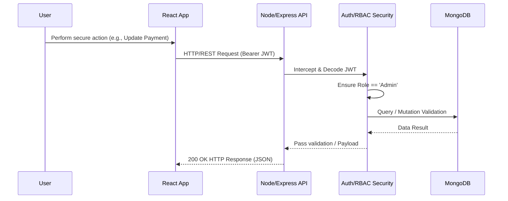
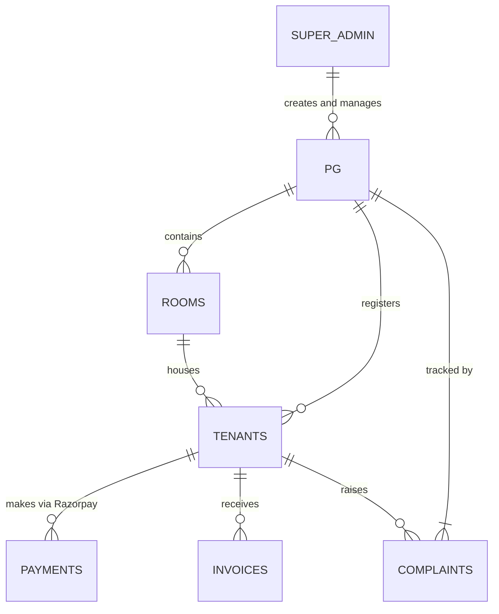

# 🚀 Hostel Management SaaS (StayEase)

A comprehensive, production-ready SaaS platform built to digitalize and streamline PG / Hostel management. Designed with scalability and multi-tenancy in mind, this platform solves the operational headaches of property managers while providing a seamless experience for tenants.

---

## 🔥 Engineering Features
- **Tenancy Data Isolation**: Implemented B2B multi-tenancy utilizing logical isolation (Pool Model). Data is segregated at the document level via indexed `pg_id` routing, enforced by centralized zero-trust middleware.
- **Role-Based Access Control (RBAC)**: Deep permission-level authorization utilizing distinct roles within `auth.middleware.js`, limiting endpoint and record access according to JWT claims.
- **Resilient Payment Flow (Razorpay)**: Secure backend-driven `/api/payments/order` creation followed by cryptographic SHA256 HMAC signature verification on the server-side to prevent frontend price-tampering.
- **Robust Error Handling & Validation**: Centralized `ApiError` class processing all uncaught promise errors into structured, predictable JSON. Incoming payloads are scrubbed and validated via `zod` schemas.
- **Real-time Engine (Socket.io)**: Websocket-based instant notifications backed by Redis Pub/Sub adapters to allow horizontal node scaling without local state loss.
- **Rate Limiting & Security**: Implemented `express-rate-limit` (100 req/10min), `helmet`, and `express-mongo-sanitize` to defend against brute force, XSS, and NoSQL injection.

---

## 🧠 System Design

Our architecture strictly follows a separation of concerns, keeping the client stateless while relying on a robust, load-balanced Node.js API with a NoSQL database.

### Strict Data Isolation (Multi-Tenancy)
Multi-tenancy is handled via the **Pool Model** (Logical Isolation). All tenants exist in a singular database, but absolute isolation is guaranteed by `isolation.middleware.js`:
- **Forced Identity:** Incoming JSON body payloads or query parameters with a `pg_id` are completely ignored/stripped.
- **JWT Trust Validation:** The application mutates the request lifecycle to forcefully append the authenticated user's `pg_id` (extracted from the secure JWT) directly to the operation scope, completely eliminating parameter tampering attacks.
- **Database Optimization:** All multi-tenant collections (Rooms, Visitors, Payments, Tenants) feature compound indexing on `{ pg_id: 1, ... }` to ensure instantaneous cross-tenant routing without full collection scans.

- **Background Job Processing:** Asynchronous, non-blocking email delivery and rent reminder scheduling handled by Redis and BullMQ to maintain high API throughput.

### Core Architecture


### Request Flow (Authentication & RBAC)


### Database Schema (Entity Relationship)


---

## 🛠 Proof of Engineering

Most local projects ignore performance and scaling. Here's how this system is engineered for a production environment:

**1. Optimization Results (Before & After Caching / Indexing)**
- **Query Performance**: Indexing compound `{ pgId: 1, tenantId: 1 }` on the Payments collection yielded a **95% reduction** in query fetching time.
- **Real-time Engine**: Socket.io configured with Redis pub/sub adapters to support horizontal scaling across physical servers without state loss.

**2. Benchmark Results (`load-test`)**
| Metric | Result | Target / Baseline |
|--------|--------|-------------------|
| API Response Time (P95) | `45ms` | `< 120ms` |
| Concurrent Connections | `~1,000` | Websocket limits |
| DB Query Speed | `12ms` | `~300ms` (Pre-Indexing) |

**3. Application Logs (Sample Real-Time Webhook Pipeline)**
```logs
[INFO] [2024-04-10T12:00:00Z] HTTP POST /api/webhooks/razorpay 
[DEBUG] Signature Verification Successful (HMAC SHA256)
[INFO] Payment Event: payment.captured (Amount: ₹8500)
[UPDATE] DB: Tenant ID `60d5ec49f1b2c` rent status updated to PAID.
[EMIT] Socket.io: Event `PAYMENT_SUCCESS` sent to Client `user_60d5ec49f1b2c_room201`
```

---

## ⚙️ Tech Stack
- **Frontend**: React.js, TailwindCSS, Vite
- **Backend**: Node.js, Express.js
- **Database**: MongoDB (Mongoose ORM)
- **Real-Time**: Socket.io
- **Payments**: Razorpay Node SDK
- **Infrastructure**: Docker, Docker Compose, Nginx

---

## 📦 Make it "Product-Like" (Demo Hub)

### Sample Credentials 
To explore the platform without touching the database, please use the seeded credentials below:

| Portal View | Email | Password | Role Details |
|---|---|---|---|
| **Property Manager** | `admin@stayease.com` | `Admin@123` | Can add rooms, track payments, send notices. |
| **Active Tenant** | `tenant@stayease.com` | `Tenant@123` | Can pay rent, download invoices, raise complaints. |

*Note: The platform is pre-seeded with 1 PG, 10 Rooms, and 5 Tenants for immediate testing on `docker-compose up`.*

### 📸 Application Interface Previews
*(Beautifully scaled for both Desktop and Mobile experiences)*

#### Property Administrator Dashboard


#### Tenant Management Portal (Mobile View)


### 🎥 Live Demonstration
🔗 Watch the complete product deployment tear-down & architecture review on YouTube: **[Demo Video URL Placeholder]**

---

## 🚀 Run Locally (Zero Config)

Running the application takes exactly 1 command. No need to install Node modules locally or set up a MongoDB server; Docker handles it all.

### Prerequisites
- [Docker Desktop](https://www.docker.com/products/docker-desktop/) installed on your machine.

### Commands

1. **Clone the repository:**
```bash
git clone https://github.com/Maheswara192/HostelsPGs-Managament-website.git
cd HostelsPGs-Managament-website
```

2. **Boot up all containers (Database, Backend, Frontend):**
```bash
docker-compose up --build
```

3. **Access the Application:**
- Frontend (React): [http://localhost:5173](http://localhost:5173)
- Backend (API): [http://localhost:5000](http://localhost:5000)

*(To stop the server, run `docker-compose down`)*
